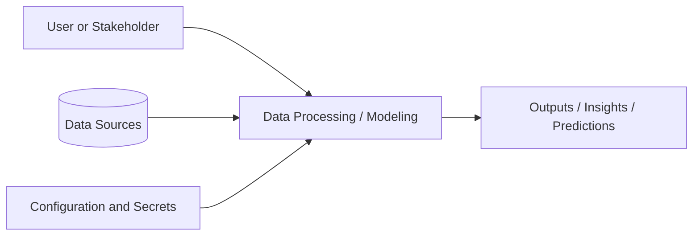

# Design Document Guide for DS3 Projects

This document is meant to guide students on what to include when they write their own design document for a data science or machine learning project. It should help future readers understand the problem, the approach, and the implementation plan.

## Overview

Describe the project at a high level. Explain what the project is about, what domain it belongs to, and why it matters. Briefly mention whether it is a data analysis, machine learning, forecasting, NLP, computer vision, or other type of project.

## Customer Identification & Problem Statement

Identify the intended users, stakeholders, or customers of the project. Explain the problem they face and why it is worth solving. This section should answer:

- Who is the customer or target user?
- What pain point or decision problem are they experiencing?
- Why is this problem important?
- What outcome would make the project successful?

## Background Research and Related Work

Summarize the existing research, methods, or similar prior work related to the problem. This section should help readers understand what has already been done and how your project builds on or differs from it. Include any relevant papers, tools, open-source solutions, industry approaches, or prior course projects that informed your thinking.

## Goals

List the main objectives of the project. These should be specific enough that someone can tell whether the project succeeded. Good goals may include improving prediction accuracy, generating useful insights, supporting a decision-making workflow, or automating a repetitive analysis task.

## Non-Goals

Clarify what is intentionally out of scope for this version of the project. This helps prevent scope creep and makes the project easier to evaluate.

## System Architecture

Provide a high-level view of how the system works. Include the main components, how they interact, and how data moves through the workflow. A Mermaid diagram is a good way to communicate this clearly.

## Data Sources

Describe where the data comes from and how it will be used. Include:

- the source of the data
- whether it is public, private, scraped, collected, or simulated
- the format and structure of the data
- any known quality issues, missing values, or labeling concerns
- how the data will be stored and prepared for analysis

If the project uses external APIs, note how credentials will be handled and how the data will be accessed responsibly.

## Execution Flow

Explain the step-by-step workflow from start to finish. This section should describe how the project will be run in practice, including:

- data loading
- cleaning and preprocessing
- exploratory analysis
- model training or analysis steps
- evaluation and validation
- output generation or deployment

The goal is to show how a person could reproduce the work from beginning to end.

## Security and Configuration

Explain how the project handles configuration, dependencies, and sensitive information. Include details about environment setup, package management, and secrets. **.env files are generally not shared on GitHub; they are included here only as an example template via .env.example.**

## Risks and Mitigations

Identify likely risks to the project and how they will be addressed. Common risks include poor data quality, insufficient labels, privacy concerns, limited compute resources, unclear requirements, and overfitting. For each risk, mention the mitigation strategy.

## Rollout Plan

Describe how the project will be validated, shared, and extended. This can include steps for testing, documenting the workflow, presenting results, or handing off the project to future contributors.
